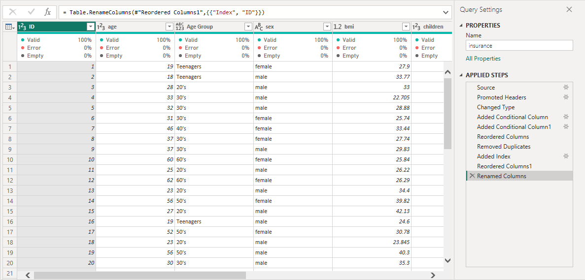
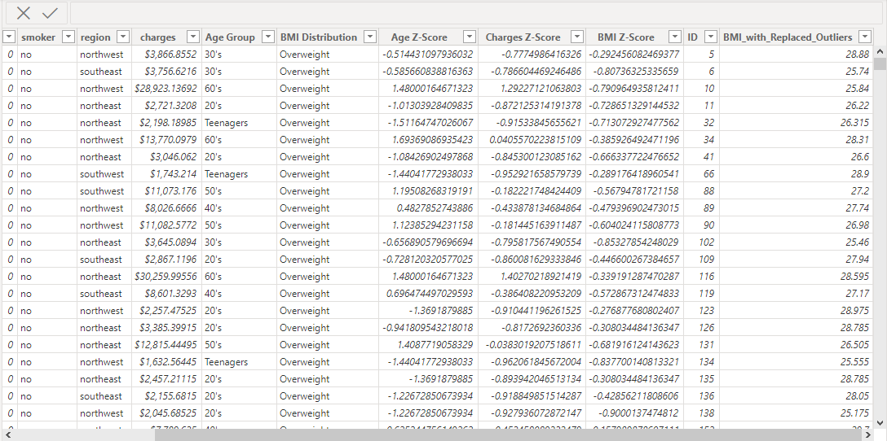
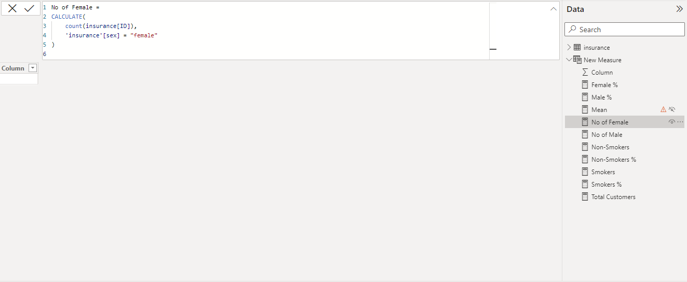
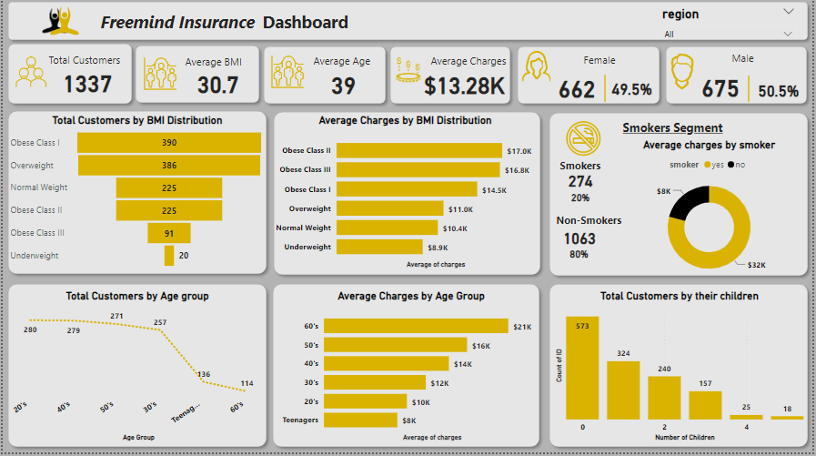

# Freemind-Insurance-Analysis
This project involves analyzing an health insurance dataset to understand the factors influencing insurance charges considering individuals age, sex, BMI, number of children, smoking status and region. The picture below is gotten from [freepiks website](https://www.freepik.com/free-photo/life-health-insurance-policy-concept-idea_1211580.htm#query=insurance%20policy&position=1&from_view=search&track=ais&uuid=f7c443cf-b85d-493d-ae15-5ae21b30f038)

## Introduction
This report presents a comprehensive analysis of an health insurance dataset on Power BI. It aims to understand the factors influencing insurance charges. The dataset consists of information on individuals, including their age, sex, BMI, number of children, smoking status, region, and insurance charges. The analysis addressed all the problem statement, discover lots of insights and detect significant determinants that influence charges.

## Problem Statement
The goal of this analysis is to address these questions:
* What is the distribution of insured individuals based on age, and how does it impact insurance charges?
* What is the average BMI of insured individuals, and is there a relationship between BMI and insurance charges?
* How does the number of children influence insurance charges?
* What proportion of the insured population are smokers, and how does smoking status correlate with insurance charges?
* Are there any specific regions where insurance charges are consistently higher or lower?
* What are the primary factors contributing to higher insurance charges in the dataset?
* How do these customer segments based on age, BMI differ in terms of insurance charges and other characteristics?
* Highlight any trends, outliers, or patterns that you observe.

## Skills and Concepts Demonstrated
The following are skills and concepts demonstrated when working on this project
* Data Exploration
* Filtering and Slicing
* Performed advanced DAX calculations for solving statistical measures and other mathematical formulas
* Correlation and Analysis
* Customer and BMI Segmentation
* Creating key performance indicators (KPIs) and other business calculations
* Data Visualization

## Data Source
This dataset was provided by my Data Science Facilitator.
*Disclaimer* This is not for a real company 

## Data Transformation
Data preparation and cleaning was done on Power Query Editor and the following are the steps taken to prepare the data for further analysis:
•	Changed all fields to the appropriate data types

•	Removed duplicates (They were 1338 rows and reduced to 1337  rows)

•	Added new column using ‘conditional column’ to create age distribution between age 18 to 64 

•	Added another column to create a standard BMI (Body Mass Index) distribution from 15.96 to 53.13

•	The ‘index column - from 1’ was created to give all individuals it unique ID 

•	The newly added columns were renamed and reordered to their appropriate place

* Data Cleaning

## Data Analysis
To detect outliers, Z-score and scatter plots were used. In the case of Z score, Z-Score was calculated on numeric column and outliers were identified. The following are report of outliers found in numeric columns;
* No outliers detected on age column
* 4 records were identified as outliers on BMI column.
* No outliers detected on children column
* No outliers detected on charges column.

Treatment of Outliers
BMI Outliers: Outliers in the BMI variable are 4. These 4 outliers in BMI column are replaced with the mean value of the column using DAX

* Z Score

* DAX

Insights from scatter plot
* With scatter plot, outliers were identified in charges variable and it shows 8 outliers. These outliers were transformed and replaced with IQ3
* The results shows that there’s a positive relationship between age and insurance charges.
* It indicate that age has a significant impact on insurance charges meaning the older you get the higher the charges, while the number of children has a minimal effect.
* It shows that age and BMI values are great determinant of charges

## Data Visualization
This dashboard is user-friendly and interactive. It makes use of slicer to show results by region. The dashboard shows all information of insured individuals and how it influence the insurance charges.

## Insights
* The majority of customers fall within the BMI Distribution of Obese Class 1 with the total of 390 individuals while Obese Class II has the highest average charges across the BMI distribution.
* The age distribution in the dataset ranges from 18 to 64 years, with an average age of 39 years. The majority of customers fall within the 20 to 29 age range.
* The dataset includes a relatively balanced distribution of genders, with 50.5% male and 49.5% female with an average charges of $13975 and $12570
* BMI values vary across the dataset, with an average BMI of 30.7. This indicates that on average, customers are classified as Obese Class I.
* Most customers in the dataset have fewer than three children, with an average of 1.09 children.
* Customers in 60’s age range pays more with an average charges of $21,000 and also appears the most populated in Obese Class I & Obese Class II in the BMI Distribution.
* Approximately 20% of customers in the dataset are smokers, while the majority (80%) are non-smokers and the average charges for smokers and non-smokers are 32k and 8k respectively.
* The dataset covers individuals from four different regions, with the distribution as follows:
•	Northeast: 24%
•	Southeast: 27%
•	Southwest: 24%
•	Northwest: 25%

## Conclusion
* This analysis has identified outliers in the 'BMI' and 'Charges' variables within the insurance dataset.
* Age and BMI appear to be the significant determinants that influence charges with smokers incurring higher charges.
* As age goes up, the charges goes up: this indicates a positive direct relationship between these two variables. Age is a pretty good predictor of charges since the regression line is almost a perfect diagonal line.
* Those in Obese Class II especially in 60’s age group pays the largest amount of insurance charges to cover the medical expenses.

## Thank you for reading.
I am open to data roles.

Let's have discussion about your company and industry now!
